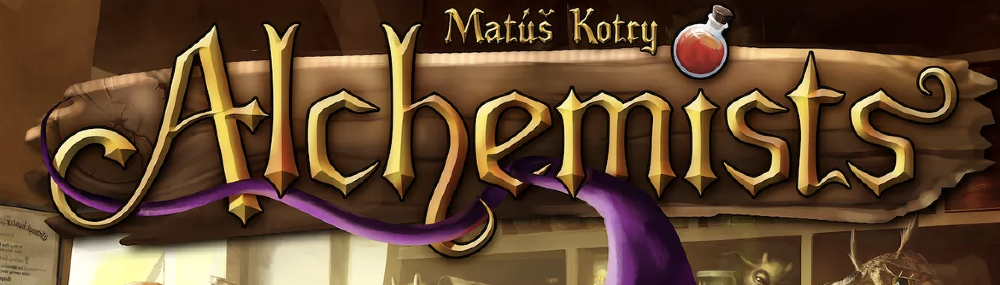
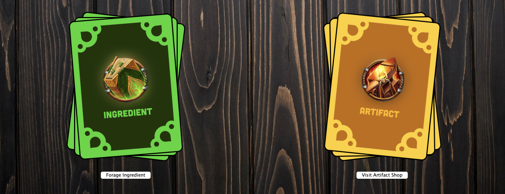
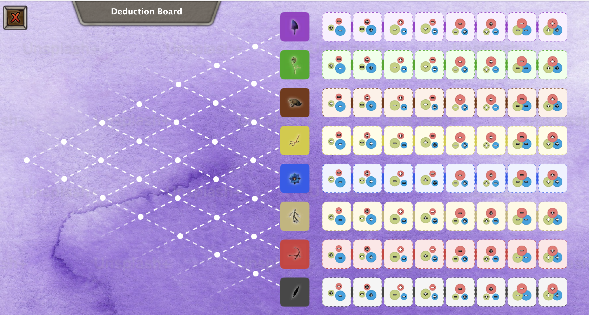

# KU Alchemist Game
The final project of COMP302 (Software Engineering) of Koç University course written in Java, using Swing. 
Welcome to the digital implementation of the captivating board game, Alchemist! This repository contains the code and resources necessary to play the game in a digital format. This is the final project of COMP302 (Software Engineering) of Koç University course written in Java, using Swing.

# About Alchemist

Alchemist is a strategic board game that combines deduction, logic, and alchemical experimentation. Players take on the roles of aspiring alchemist seeking to discover the secrets of the mystical Philosopher's Stone. Through deduction and experimentation, players brew potions, publish theories, and uncover the properties of various ingredients.

# How to Play

To start playing Alchemist digitally:

1. Clone or download this repository to your local machine.
2. Install the necessary dependencies (if any) as outlined in the documentation.
3. Run the application following the instructions provided in the README or documentation.

# Contributing

Contributions to improve this digital implementation of Alchemist are welcome! Feel free to fork the repository, make changes, and submit pull requests.

# Credits

This digital implementation of Alchemist is developed/maintained by our amazing team. The game itself was created by Czech Games Edition and designed by Matúš Kotry. You can reach the original game via <a href="https://boardgamegeek.com/boardgame/161970/alchemists">this link.</a>

# Disclaimer

This implementation is unofficial and is not affiliated with Czech Games Edition. It is a fan-made adaptation intended for personal use and entertainment purposes only.

## Instructions
- To clone the repository: <code>git clone https://github.com/comp-302-group-1/alchemist-game</code>
- To checkout to a branch: <code>git checkout {branch-name}</code>
- To open a new branch: <code>git branch {branch-name}</code>
- Branch only on **development** branch and merge back to it.
- Open pull request to merge your branch and never merge before code review.
- **Never** directly commit to the main branch as we will merge development into it only on deployment.

## How to push your code?
After cloning the repo first time, make sure your branch is development (<code>git checkout development</code>). On development branch, open a new branch based on your code (<code>git branch {branch-task-name}</code>) and checkout to it (<code>git checkout {branch-task-name}</code>). Make your development, commit and push your code using following commands:
1. git add .
2. git commit -m "commit-message"
3. git push -u origin branch-task-name

For commit messages use conventions indicated in [this](https://gist.github.com/qoomon/5dfcdf8eec66a051ecd85625518cfd13) document. Such as _fix-potion-brewing-area_.

